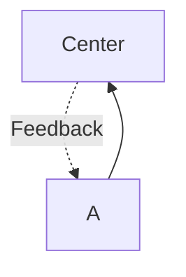
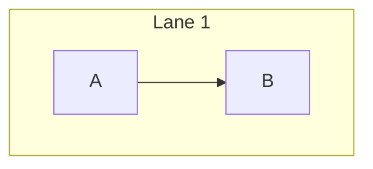

# Mermaid Syntax Addendum

## Critical Syntax Escaping

**1. Markdown List Collision (`Parse error: Unsupported markdown`)**

NEVER use `<number>.<space><text>`. It breaks the parser.

`❌ [1. Perception]`

`✅ [1.Perception]` or `[① Perception]` or `[(1) Perception]`

**2. Strings & Punctuation**

- Spaces: Surround in quotes `["Like This"]`
- Disallowed Characters:
  - `"Quotes"` -> `『Quotes』`
  - `(Parens)` -> `「Parens」`
- Line Breaks: ` ` is only officially supported inside circle nodes `(( ))`. Use annotation nodes for long texts.

**3. IDs vs Labels**

`❌ Subgraph With Spaces` -> `✅ subgraph sg_id["Subgraph With Spaces"]`

`❌ Node Name --> Target` -> `✅ node_id --> target_id`

## Core Layouts

**Flowchart (TB/LR)**

`graph TB` (Top-Bottom) / `graph LR` (Left-Right)

- Solid Arrow: `-->`
- Dashed Arrow: `-.->`
- Thick Arrow: `==>`
- Label on Arrow: `-->|Label|`
- Invisible Link (for forcing coordinate layout): `~~~>`

**Cyclic / Hub Flow**

**Swimlanes & Hierarchies**

Subgraphs auto-group nodes:

*Note: Max 2 nested subgraphs to preserve readability.*

## Diagram Node Shapes

`A[Rect]`

`B(Rounded)`

`C([Stadium])`

`D((Circle))`

`E>Right Arrow]`

`F{Decision}`

`I[(Database)]`

## Multi-Target Paths

`A --> B & C`

`A & B --> C`

`A <--> B` (Bidirectional)

## Quality Checks

- Nodes have descriptive IDs but are short.
- Explicit `style` strings apply matching colors.
- Layout flow direction explicitly set.
- No loose strings containing unescaped spaces.
- No Emojis (causes width alignment break issues inside SVGs/PNGs).